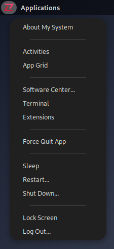
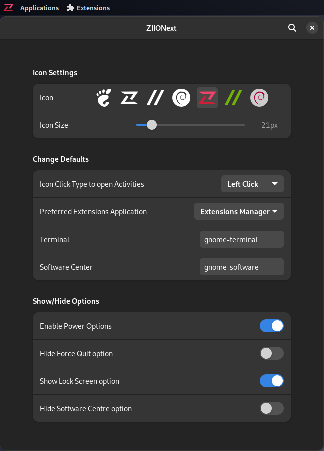

# ZIIONext

Menu for the GNOME panel with options to provide quick access to system actions and information. It provides a similar experience to the top-left Apple menu on MacOS.

Compatible with and tested on GNOME 43, 42, 41, 40, 3.xx

## Screenshots





## Options include:

-About My System (opens a submenu in System Settings that shows info about your computer)

-Activities (this menu does replace the Activities button, but this option does leave that functionality easily accessible)

-App Grid (Opens GNOME app menu/grid)

-Software Center (defaults to `gnome-software`)

-Terminal (defaults to `gnome-terminal`)

-Extensions (Quick access to all of your GNOME Extensions)

-Force Quit App (run this and select the app you want to kill. Requires `xkill`)

-Power Options

## Installation

* Via **Gnome Extensions**

[](https://extensions.gnome.org/extension/5559/ziionext/)

* **Manually**

Grab the latest release and unzip to `.local/share/gnome-shell/extensions/ziionext@halborn/`

**or**

using GNU make:

```bash
git clone https://github.com/halbornlabs/ZIIONext.git
cd ZIIONext
make install
```

## Credits

Heavily modified fork of [Logomenu](https://github.com/Aryan20/Logomenu), which is itself a fork of [Tofu Menu by tofutech](https://github.com/tofutech/tofumenu), forked from [Big-Sur-Menu by Fausto](https://github.com/Fausto-Korpsvart/Big-Sur-Menu), which was forked from [poppy-menu](https://extensions.gnome.org/extension/1279/poppy-menu/)

Original extension creators and all the contributors:
[@Aryan20](https://github.com/Aryan20), [@kaansenol5](https://github.com/kaansenol5) , [@ShrirajHegde](https://github.com/ShrirajHegde), [@AndrewZaech](https://github.com/AndrewZaech), [@Harshad.Gavali](https://gitlab.com/harshadgavali), [@JustPerfection](https://gitlab.com/justperfection.channel) [@vikashraghavan](https://github.com/vikashraghavan)
[@Fausto-Korpsvart](https://github.com/Fausto-Korpsvart), [Frippery Applications Menu](https://extensions.gnome.org/extension/13/applications-menu/) - Original Code
